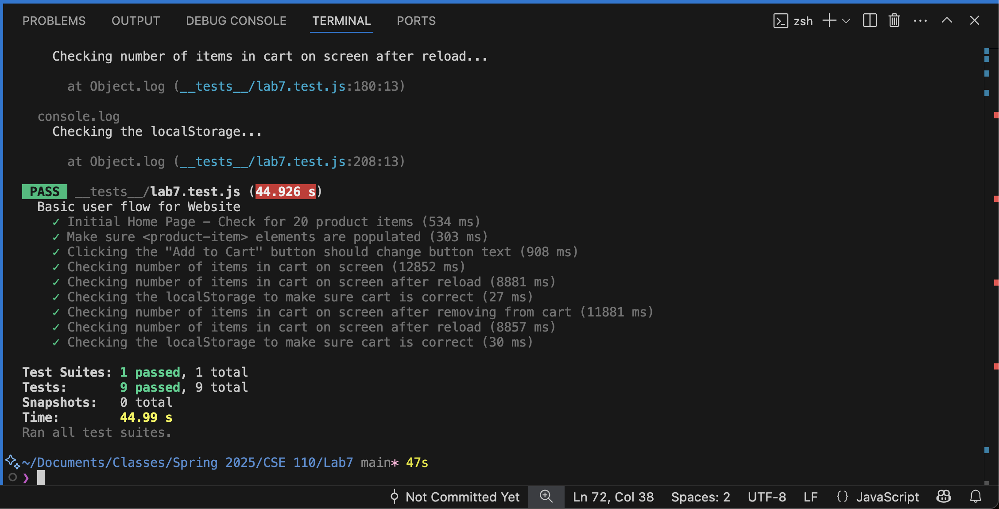

# Lab 7

## Team Members:
Sachin Ramanathan, Benjamin Miller

## Test Results

## Check your Understanding

1) Where would you fit your automated tests in your Recipe project development pipeline? Select one of the following and explain why.

I'd put them within a GitHub action that runs whenever code is pushed, so that we can enforce consistent tests being required to pass before any PRs can be merged, and make it scalable even with many members collaborating.

2) Would you use an end to end test to check if a function is returning the correct output? (yes/no)

No, I would use a unit test for this.

3) What is the difference between navigation and snapshot mode?

Snapshot mode is a static look at the current loaded page and does analysis based on the current loaded page. Navigation mode loads the site and does a more comprehensive test.

4) Name three things we could do to improve the CSE 110 shop site based on the Lighthouse results.

- The performance is mediocre, the largest image/text takes 4.7s to load. Could look into lowering image size to load it faster
- The <html> element does not have a lang atribute which is an accessibility issue.
- The document does not have a meta descripition that summarizes the page content that would be included in search results.
